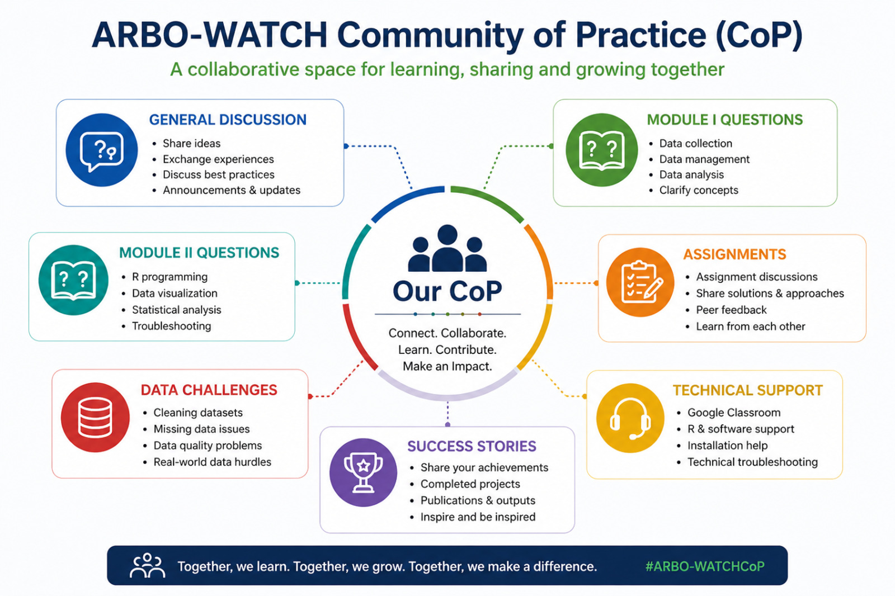

::: {style="text-align: center; margin: 1.5rem 0 2rem 0;"}
{style="max-width: 820px; width: 100%; border-radius: 12px; box-shadow: 0 4px 18px rgba(0,0,0,0.12);" fig-alt="ARBO-WATCH Community of Practice — a collaborative space for learning, sharing, and growing together"}

::: {style="color: #6c757d; font-size: 0.9rem; margin-top: 0.5rem;"}
*Connect · Collaborate · Learn · Contribute · Make an Impact*
:::
:::

---

### Discussion Forum

Connect, collaborate, and share knowledge with fellow ARBO-WATCH training alumni and facilitators.

---

::: {.callout-note appearance="simple"}
*The discussion forum is coming soon. Check back for updates on how to join the community.*
:::
