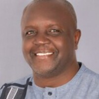
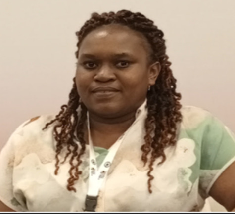

### About the Project

The ARBO-WATCH project seeks to design and deploy dengue and Chikungunya fever decision support tools informed by process-based models in Kenya, Somalia and Ethiopia. 
These analyses will utilize relevant primary and secondary data from all these countries to uncover broader epidemiological patterns of these diseases in the region. 
The project is being implemented by a consortium made up of nine institutions including ILRI, the Kenya Medical Research Institute, Kenya’s Ministry of Health, 
Jomo Kenyatta University of Agriculture and Technology, Ethiopia Public Health Institute, Global One Health Initiative, Ohio State University, Abrar University and the Ministry of Health Somalia.

Read [here to learn more](https://www.ilri.org/research/projects/arbo-watch-project) about the project.



### Curriculum Overview

- This curriculum is designed to strengthen analytical capacity in infectious disease
surveillance and outbreak response.
- It promotes mastery of research design, data analysis, modelling, visualization, and
decision-support tools.
- The training emphasizes the use of free and open-source platforms for accessibility and
sustainability.
- The curriculum is organized into five (5) modules, and each module has been allocated
the training number days, but additional module content is available online.

::: {.callout-tip title="Overall Goal"}
To build an end-to-end skill set that moves participants from data collection to analysis,
modelling, mapping, and decision-making.
:::

### Modules Overview

::: {#workshop-listing}
:::

## JKUAT Team

::: {.educator-list}

::: {.educator-card}
{.educator-photo}

::: {.educator-content}
### Henry Athiany

*Research Biostatistician*

Henry Athiany is a Lecturer in the Department of Statistics and Actuarial Sciences (STACS) at JKUAT, with training in Biostatistics and Epidemiology and a background in Mathematics and Computer Science. His research spans epidemiology, infectious disease modelling, Bayesian and spatiotemporal analysis, clinical trials, statistical computing, bioinformatics, time-series forecasting, and mental health analytics. With over 15 years of experience working with large-scale eHealth and routinely collected healthcare data, he has contributed to national public health initiatives, including serving on Kenya’s COVID-19 Modelling Technical Committee and supporting multiple Ministry of Health projects on digital health systems, diagnostics optimization, and health information interoperability. He is also an experienced trainer in statistical software and research methods and has held leadership roles within the International Biometric Society and the Statistical Society of Kenya. Currently, he supports the ARBO-WATCH project as part of the JKUAT team.
:::
:::

::: {.educator-card}
{.educator-photo}

::: {.educator-content}
### Caroline Wanja Mugo

*Lecturer Biostatistics*

Caroline Wanja Mugo is a Lecturer in Biostatistics at JKUAT with a background in Biostatistics and Epidemiology. Her research interests include infectious disease epidemiology, statistical methods for public health, and data-driven decision-making. She has experience working with large datasets and routinely collected healthcare data, contributing to national public health initiatives. Caroline has also been involved in training and capacity-building efforts in biostatistics and epidemiology. She currently supports the ARBO-WATCH project as part of the JKUAT team.
:::
:::

::: {.educator-card}
{.educator-photo}

::: {.educator-content}
### Anthony Waititu

*Associate Professor*

Gichuhi A. Waititu is an Associate Professor of Statistics at Jomo Kenyatta University of Agriculture and Technology (JKUAT), Kenya. He currently serves as the Dean of the School of Mathematics and Physical Sciences at JKUAT. He has over twenty (20) years of experience in teaching applied statistics at university level, alongside extensive engagement in research and academic leadership. His research interests focus on Machine Learning and Artificial Intelligence, with applications in data science and statistical modelling.

:::
:::

::: {.educator-card}
{.educator-photo}

::: {.educator-content}
### Charity Wamwea

:::
:::

:::

## Partners
- [International Livestock Research Institute](https://www.ilri.org)
- [Jomo Kenyatta University of Agriculture and Technology](https://www.jkuat.ac.ke)
- [Kenya Medical Research Institute](https://www.kemri.go.ke)
- [Kenya Meteorological Department](https://meteo.go.ke/)
- [Ethiopian Public Health Institute](https://ephi.gov.et/)
- [Abrar University in Somalia](https://abrar.edu.so/)
- [Federal Ministry of Health in Somalia](https://moh.gov.so)
- [Global One Health Initiative](https://oia.osu.edu/global-one-health-initiative)
- Kenya’s Department of Disease Surveillance and Epidemic Response
- [Ohio State University](https://osu.edu)
